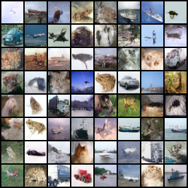
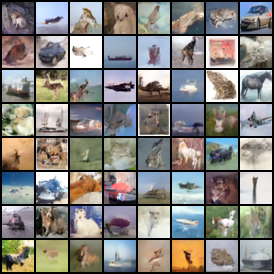

### Introduction

这个仓库是我对DDPM论文的一个简单的复现，我在cifar10上进行训练，由于设备限制训练时间并不充分，生成效果不是非常好。

### Usage

```bash
mkdir images 
```

```bash
python eval.py --steps 1000
```

使用DDIM
```bash
python eval.py --steps 200 --DDIM
```

### Result

1000步生成效果



100步（DDIM）效果




### 使用probability ODE采样

在此[kopper-xdu/diffusion-sample (github.com)](https://github.com/kopper-xdu/diffusion-sample#diffusion-sample)实现